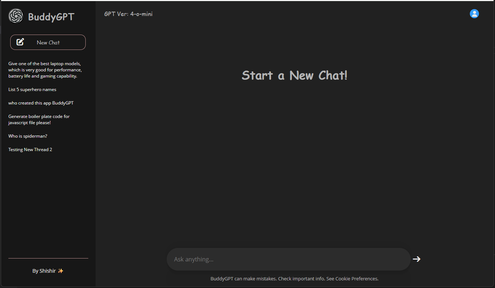

# BuddyGPT
BuddyGPT is a GPT clone using Open AI.

OverView:

## TechStack
- Frontend - React + CSS
- Backend - Node.js + Express.js
- Database - MongoDB

## Model 
1. ThreadSchema contains
threadID
title
messages
createdAt
updatedAt

2. MessageSchema
role -> User, Assistant
content
timestamp

"cors": "^2.8.5",
"dotenv": "^17.2.3",
"express": "^5.1.0",
"nodemon": "^3.1.11",
"openai": "^6.9.1"

## Features:
- Latest reply has a typing effect with word by word printing.
- Hover on each history threads to observe the delete option popup.
    - Click on each history threads to view their respective chats.
